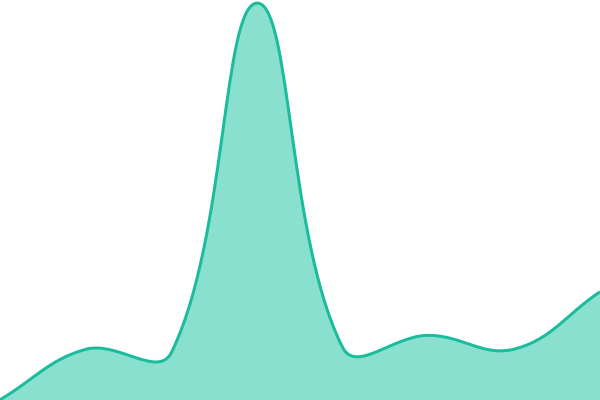
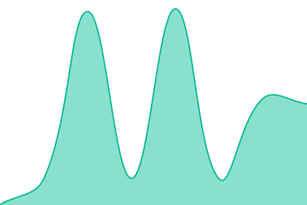
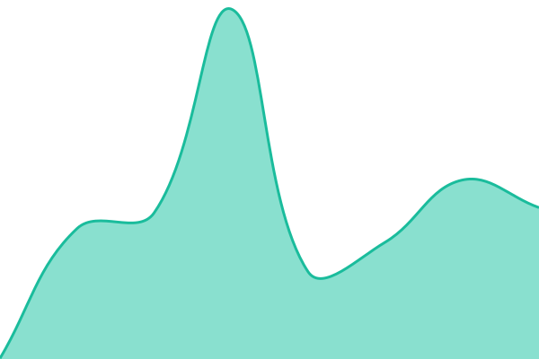
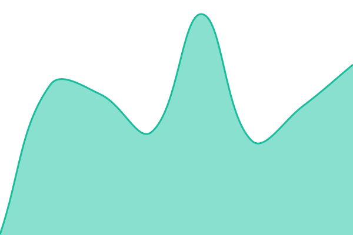
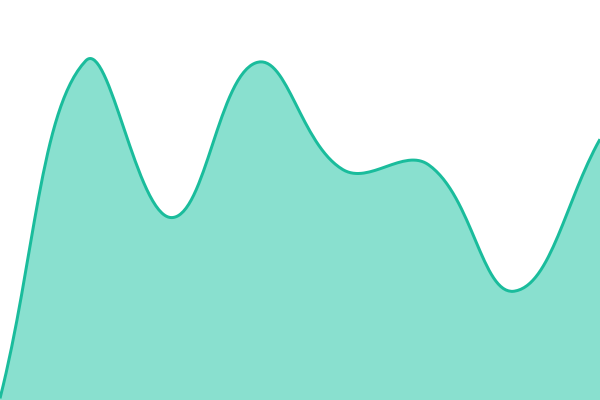
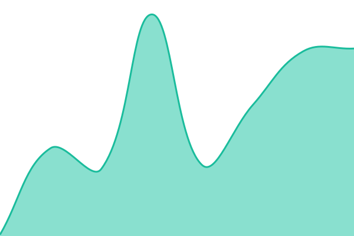

# [📈 Live Status](https://chanuptime.qzz.io): <!--live status--> **🟧 Partial outage**

This repository contains the open-source uptime monitor and status page for [Upptime](https://upptime.js.org), powered by [Upptime](https://github.com/upptime/upptime).

With [Upptime](https://upptime.js.org), you can get your own unlimited and free uptime monitor and status page, powered entirely by a GitHub repository. We use [Issues](https://github.com/upptime/upptime/issues) as incident reports, [Actions](https://github.com/octocat145/supreme-spoon/actions) as uptime monitors, and [Pages](https://chanuptime.qzz.io) for the status page.

<!--start: status pages-->
<!-- This summary is generated by Upptime (https://github.com/upptime/upptime) -->
<!-- Do not edit this manually, your changes will be overwritten -->
<!-- prettier-ignore -->
| URL | Status | History | Response Time | Uptime |
| --- | ------ | ------- | ------------- | ------ |
|  [Jchan](https://awoo.cf/jchan/) | No ar | [jchan.yml](https://github.com/octocat145/supreme-spoon/commits/HEAD/history/jchan.yml) | 

 69ms
     
 | 

<a href="https://chanuptime.qzz.io/history/jchan">100.00%</a>
    

|  [ptちゃん](https://ptchan.org/) | No ar | [pt.yml](https://github.com/octocat145/supreme-spoon/commits/HEAD/history/pt.yml) | 

 439ms
     
 | 

<a href="https://chanuptime.qzz.io/history/pt">100.00%</a>
    

|  [14chan](https://14chan.org/) | No ar | [14chan.yml](https://github.com/octocat145/supreme-spoon/commits/HEAD/history/14chan.yml) | 

 937ms
     
 | 

<a href="https://chanuptime.qzz.io/history/14chan">100.00%</a>
    

|  [1500chan](https://1500chan.org/) | No ar | [1500chan.yml](https://github.com/octocat145/supreme-spoon/commits/HEAD/history/1500chan.yml) | 

 937ms
     
 | 

<a href="https://chanuptime.qzz.io/history/1500chan">100.00%</a>
    

|  [27chan](https://27chan.org/) | No ar | [27chan.yml](https://github.com/octocat145/supreme-spoon/commits/HEAD/history/27chan.yml) | 

 130ms
     
 | 

<a href="https://chanuptime.qzz.io/history/27chan">100.00%</a>
    

|  [67chan](https://67chan.org/) | No ar | [67chan.yml](https://github.com/octocat145/supreme-spoon/commits/HEAD/history/67chan.yml) | 

 1188ms
     
 | 

<a href="https://chanuptime.qzz.io/history/67chan">100.00%</a>
    

|  [Anões](https://anoes.net/) | No ar | [anoes.yml](https://github.com/octocat145/supreme-spoon/commits/HEAD/history/anoes.yml) | 

 1188ms
     
 | 

<a href="https://chanuptime.qzz.io/history/anoes">100.00%</a>
    

|  [CZchan](https://czchan.rf.gd/) | No ar | [c-zchan.yml](https://github.com/octocat145/supreme-spoon/commits/HEAD/history/c-zchan.yml) | 

 216ms
     
 | 

<a href="https://chanuptime.qzz.io/history/c-zchan">100.00%</a>
    

|  [gavetachan](https://gavetachan.org/) | No ar | [gavetachan.yml](https://github.com/octocat145/supreme-spoon/commits/HEAD/history/gavetachan.yml) | 

 838ms
     
 | 

<a href="https://chanuptime.qzz.io/history/gavetachan">100.00%</a>
    

|  [Goiaba](https://goiaba.fi/) | No ar | [goiaba.yml](https://github.com/octocat145/supreme-spoon/commits/HEAD/history/goiaba.yml) | 

 146ms
     
 | 

<a href="https://chanuptime.qzz.io/history/goiaba">0.00%</a>
    

|  [Gobby](https://gordy.rf.gd/) | No ar | [gobby.yml](https://github.com/octocat145/supreme-spoon/commits/HEAD/history/gobby.yml) | 

 146ms
     
 | 

<a href="https://chanuptime.qzz.io/history/gobby">100.00%</a>
    

|  [Kiwichan](https://kiwichannel.org/) | No ar | [kiwichan.yml](https://github.com/octocat145/supreme-spoon/commits/HEAD/history/kiwichan.yml) | 

 700ms
     
 | 

<a href="https://chanuptime.qzz.io/history/kiwichan">100.00%</a>
    

|  [Lusochan](https://lusochan.net/) | No ar | [lusochan.yml](https://github.com/octocat145/supreme-spoon/commits/HEAD/history/lusochan.yml) | 

 386ms
     
 | 

<a href="https://chanuptime.qzz.io/history/lusochan">100.00%</a>
    

|  [Magalichan](https://magalichan.com/) | No ar | [magalichan.yml](https://github.com/octocat145/supreme-spoon/commits/HEAD/history/magalichan.yml) | 

 45ms
     
 | 

<a href="https://chanuptime.qzz.io/history/magalichan">100.00%</a>
    

|  [minechan](https://minechan.org/) | No ar | [minechan.yml](https://github.com/octocat145/supreme-spoon/commits/HEAD/history/minechan.yml) | 

 101ms
     
 | 

<a href="https://chanuptime.qzz.io/history/minechan">100.00%</a>
    

|  [mokoichannel](https://mokoich.net/) | No ar | [mokoichannel.yml](https://github.com/octocat145/supreme-spoon/commits/HEAD/history/mokoichannel.yml) | 

 452ms
     
 | 

<a href="https://chanuptime.qzz.io/history/mokoichannel">100.00%</a>
    

|  [Reinchan](https://reinchan.org/) | Fora do ar | [reinchan.yml](https://github.com/octocat145/supreme-spoon/commits/HEAD/history/reinchan.yml) | 

 108ms
     
 | 

<a href="https://chanuptime.qzz.io/history/reinchan">0.00%</a>
    

|  [tchan](https://tchan.lol/) | No ar | [tchan.yml](https://github.com/octocat145/supreme-spoon/commits/HEAD/history/tchan.yml) | 

 74ms
     
 | 

<a href="https://chanuptime.qzz.io/history/tchan">100.00%</a>
    

<!--end: status pages-->

[**Visit our status website →**](https://chanuptime.qzz.io)

## 📄 License

- Powered by: [Upptime](https://github.com/upptime/upptime)
- Code: [MIT](./LICENSE) © [Anand Chowdhary](https://anandchowdhary.com), supported by [Pabio](https://pabio.com)
- Data in the `./history` directory: [Open Database License](https://opendatacommons.org/licenses/odbl/1-0/)
